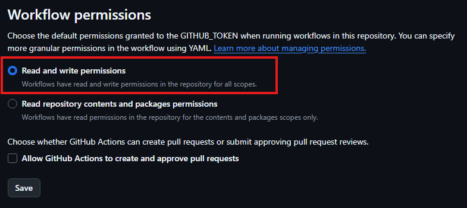

# Webpack Typescript Template

A simple template repository with Webpack for bundling with Typescript support.

To use this repository for your webpack-typescript projects:

**Step 1**: Follow Github's official instructions on [Creating a repository from a template](https://docs.github.com/en/repositories/creating-and-managing-repositories/creating-a-repository-from-a-template#creating-a-repository-from-a-template).

**Step 2**: Once your new repository is created, clone it to your local system.

```shell
# To clone repository
git clone https://github.com/<GITHUB_USERNAME>/<REPOSITORY_NAME>.git

# Change to cloned repository
cd <REPOSITORY_NAME>

# NOTE: Update <GITHUB_USERNAME> and <REPOSITORY_NAME> properly.
```

**Step 3**: Once cloned, you can run below commands from your repository directory.

To install dependencies:

```shell
# Install dependencies
npm install
```

To run development server:

```shell
# Run development server
npm run serve
```

To generate build:

```shell
# Build the project to dist/ folder
npm run build
```

To build and preview:

```shell
# Preview the contents of the dist/ folder
npm run preview
```
### Enable Github Actions to automatically build and deploy to Github Pages on every push to repository

###### *This is optional*

If you created a public repository from this template, this repository also contains Github Actions to build and deploy to Github Pages on every push. By default, in a new repository, such kind of actions won't work and will fail as Github Actions by default only has read permission to its repository. This permission have to be allowed manually by the owner of the new repository for the Github Action to work properly.

Go to your repository's `Settings` > `Actions` > `General`:

Select `Read and write permissions` (This is required as the Github Actions creates a new branch named `build` on this same repository with the generated build, which is then used to deploy to Github Pages. You can review the action code inside `.github/workflows/ directory` in your repository.)



Once saved, confirm your Github Actions is success:


If seeing success, confirm `build` branch was created in your repository automatically after this Github Action execution.


Now, you can enable Github Pages, so that generated build currently stored in `build` branch can be deployed to Github Pages.

Go to your repository's `Settings` > `Pages`:

Make sure Source is `Deploy from a branch` and Branch is `build`.


Click `Save` and wait for the `Pages Build and Deployment Action` to finish.

Once done, check your repository's Github Pages URL to see the deployed build.

*Feel free to change this Github Actions flow to deploy directly after Github Action's Build flow without requiring a separate build branch.*